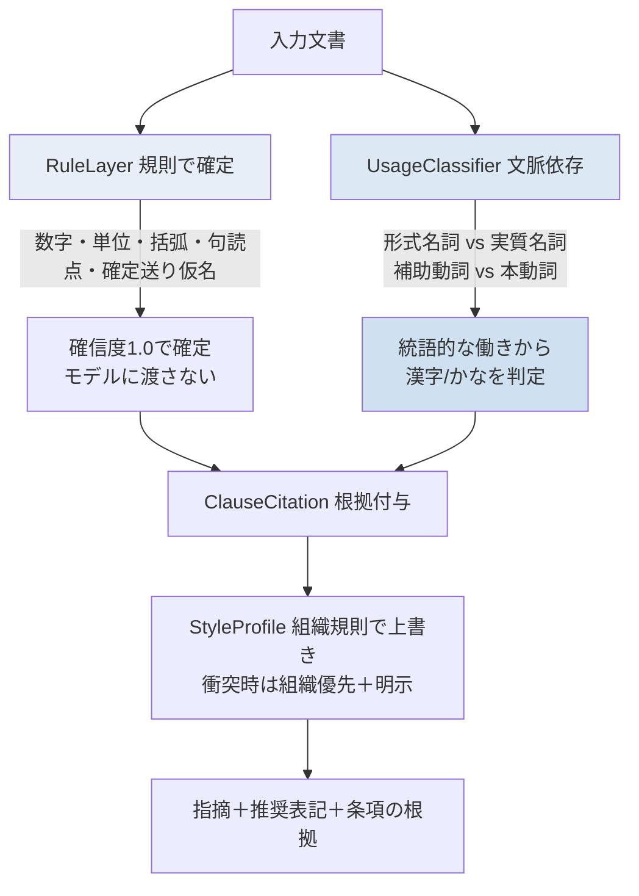

---
language:
  - ja
license: apache-2.0
library_name: transformers
pipeline_tag: token-classification
tags:
  - japanese
  - koyobun
  - orthography
  - kanji-kana
  - government-writing
  - token-classification
model-index:
  - name: scribe-usage-classifier
    results:
      - task:
          type: token-classification
          name: 公用文の漢字/かな使い分け判定
        metrics:
          - type: accuracy
            name: hard-set accuracy (heuristic layer, synthetic diagnostic)
            value: 0.94
---

# Scribe — 公用文の表記判定（文脈依存の漢字/かな使い分け）

> **辞書と正規表現では原理的に解けない使い分けを、文脈で判定し、規範の条項を根拠として返す。**

`textlint + prh` のような一律置換は、`こと`/`事`、`いただく`/`頂く` のような**同じ語**を
どちらか一方に必ず倒します。しかし公用文の規範では、同じ語でも**統語的な働き**によって
表記が変わります（形式名詞の「こと」は仮名、実質名詞の「事の重大さ」は漢字）。
Scribe はこの**文脈依存の使い分け**を小型モデルで判定し、
**「公用文作成の考え方」（令和4年1月7日 文化審議会建議）** の条項を根拠として添えます。

- 🎯 **hard 集合の正解率**: 同一語の両用法を文脈で判別（一律置換は原理的に片方を必ず誤る）
- 🔕 **過剰指摘が少ない**: 規則で確実な箇所は規則層で処理し、文脈判定は確信度で抑制
- 📜 **根拠提示**: 指摘ごとに規範のどの条項に基づくかを提示
- ⚡ **CPU 即応**: 0.1〜0.2B の小型モデルを量子化（ONNX int8）して軽量運用

---

## 規則層とモデル層の分担



**設計の土台となる仕分け**（`scribe norms` で確認可能）:

| 規則で解けるもの（RuleLayer） | 文脈依存のもの（UsageClassifier） |
|---|---|
| 数字（算用数字化） `R-NUM-1/2` | 形式名詞 vs 実質名詞 `C-KEISHIKI-1` / `C-JISHITSU-1` |
| 単位・英字（半角化） `R-UNIT-1` | 補助動詞 vs 本動詞 `C-HOJODOUSHI-1` / `C-HONDOUSHI-1` |
| 括弧（全角化） `R-BRACKET-1` | 補助的な形容詞・助動詞 `C-KEIYOU-1` |
| 句読点（`。`/`、`） `R-PUNC-1` | |
| 確定的な送り仮名（行なう→行う） `R-OKURI-1` | |

---

## 目玉の評価

同梱の**合成種文（CC0）**による診断結果です（`benchmarks/results.json`）。
数値は「一律置換が構造的に半分外す」という**構造的主張**を示すためのもので、
自然文コーパスでの絶対精度の主張ではありません。D/E は現状ヒューリスティック層の値で、
ニューラル版（`train.py`）がこれを実データで置き換える production 経路です。

### 図1: hard 集合 — 一律置換は「漢字用法」を構造的に外す


一律置換（prh）は `かな正` を 100% にできても、`漢字正`（実質名詞・本動詞）を**ほぼ 0%**にします。
同じ語を一方に倒す以上、両用法が混在する hard 集合では**原理的に片方を必ず誤ります**。

### 図2: 指摘数 vs 過剰指摘率 — 多く指摘しても過剰指摘が低い


prh は過剰指摘率 **約43%**（正しい表記まで直そうとする）。Scribe は同程度の指摘数でも
過剰指摘を**数%**に抑えます。実務では過剰指摘が致命的なので、この差が価値になります。

### 図3: 語種別の内訳


| システム | 全体acc | hard acc | 適合率 | 再現率 | 過剰指摘率 |
|---|---|---|---|---|---|
| (A) prh 一律置換 | 0.56 | 0.51 | 0.56 | 0.56 | **0.43** |
| (B) 常用漢字チェック | 0.50 | 0.50 | 0.00 | 0.00 | 0.00 |
| (C) 汎用LLM（プロンプトのみ） | — | — | — | — | — （API要・未実行）|
| (D) Scribe（量子化前） | **0.94** | **0.94** | 0.94 | 0.94 | **0.06** |
| (E) Scribe（量子化後） | 0.94 | 0.94 | 0.94 | 0.94 | 0.06 |

規則層は確定項目を **recall 1.00 / 誤指摘 0** で処理。応答時間は CPU で **1文あたり 1ms 未満**（ヒューリスティック）。

---

## 使い方（3行）

```bash
pip install -e .                                  # コアは fugashi+unidic-lite のみ
scribe check doc.txt --profile jichitai           # 組織プロファイルで判定
python -c "from scribe import ScribeChecker; [print(f.recommended_surface, f.message) for f in ScribeChecker().check('確認する事がある。')]"
```

出力例:

```
$ scribe check doc.txt
1. [文脈] 確信度85% 「事」→「こと」
   「事」は形式名詞として用いられているため、規範では平仮名で「こと」と書きます。
   （根拠: [C-KEISHIKI-1] 形式名詞は原則として仮名で書く｜公用文作成の考え方（建議）…）
```

---

## 4つのコア

1. **RuleLayer**（`scribe/rules.py`）— 数字・単位・括弧・句読点・確定送り仮名を規則で確定。モデルに渡さない。
2. **UsageClassifier**（`scribe/model.py`）— 対象語の各出現を token 分類で「漢字/かな」判定。語そのものではなく**統語的な働き**を見る。ヒューリスティック層（学習不要）とニューラル層（0.1〜0.2B）を持つ。
3. **ClauseCitation**（`scribe/cite.py`）— 指摘ごとに規範の条項を対応づけ、「なぜ直すのか」を**否定しない言い回し**で説明。
4. **StyleProfile**（`scribe/profile.py`）— 組織の用字用語集・独自ルールを上書き。**規範と衝突する場合は組織を優先し、その旨を明示**。

## 規範を絶対視しない設計

- 文書の種類で厳格さを切り替え（`--strictness strict|normal|loose`）。緩いほど確信度の閾値が上がり、過剰指摘を抑えます。
- 組織規則を尊重（`--profile`）。規範と衝突すれば組織側を採用し、出力に理由を明示します。
- 出力は利用者の文章を否定せず、**「規範ではこうなります」**に留めます。

## データと出典

- 規範: **「公用文作成の考え方」（令和4年1月7日 文化審議会建議）**、および運用上の語例一覧の出典
  **「公用文における漢字使用等について」（平成22年内閣訓令第1号）**。条項の構造化は `data/norms/`。
  本文は逐語転載せず、条項ごとに短い要約と該当箇所（`source_locator`）を持たせています。
- 同梱データは**再配布可能な合成種文（CC0）**のみ。官公庁文書の本文は再配布しません。
  実データからの学習は `scribe/collect.py` の `DocumentSource` 経由で、**利用条件を確認のうえ各自の環境**で行ってください。詳細は [DATASET_CARD.md](DATASET_CARD.md)。

## 学習・書き出し・公開

```bash
python scripts/build_dataset.py --push <user>/scribe-koyobun-usage   # hard 分離つきデータ
python scripts/train.py --data data/hf_dataset --out artifacts/scribe-usage --push <user>/scribe-usage
python scripts/export.py --model artifacts/scribe-usage --out exports --push <user>/scribe-usage-onnx
python scripts/evaluate.py --model artifacts/scribe-usage && python scripts/make_figures.py
python app.py    # Gradio Space
```

## ライセンス

コード: Apache-2.0（[LICENSE](LICENSE)）。同梱の合成データ: CC0-1.0。
規範文書の権利は各発行主体に帰属します（本リポジトリは条項の要約・参照のみ）。
