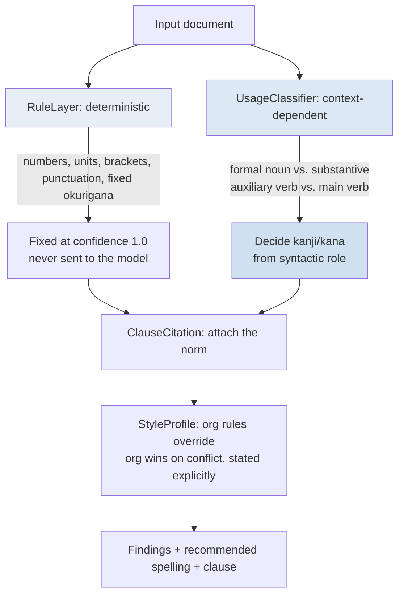
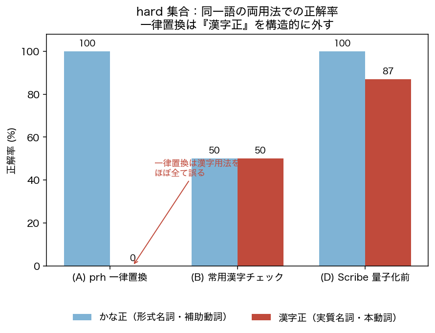
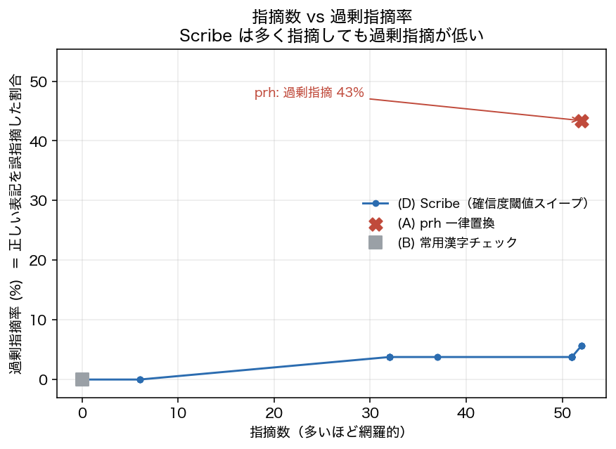
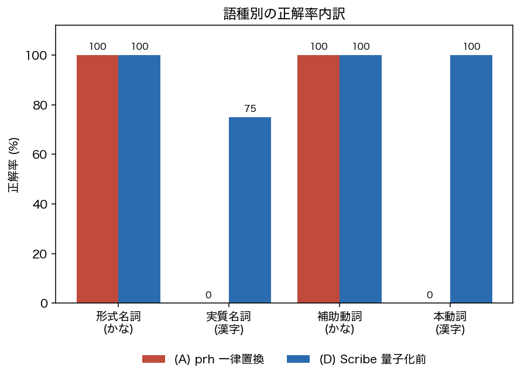

# Scribe — a context-aware kanji/kana checker for Japanese official documents

> **Judging the notation that dictionaries and regular expressions cannot solve — with the normative clause cited as evidence.**

[日本語版 README →](README.ja.md) ·
🤗 [Space](https://huggingface.co/spaces/NagaYu/scribe-koyobun) ·
🧠 [Model](https://huggingface.co/NagaYu/scribe-usage-classifier) ·
📚 [Dataset](https://huggingface.co/datasets/NagaYu/scribe-koyobun-usage)

Japanese official-writing guidelines (**"Considerations for Creating Official Documents"**, recommended by the
Council for Cultural Affairs on 7 Jan 2022) require the **same word** to be written differently depending on its
**syntactic role**: a formal noun こと is written in kana, while the substantive 事 ("the gravity of *the matter*")
is written in kanji. Uniform dictionary replacement (`textlint + prh`) collapses each word to **one** spelling, so on
text where both usages appear it is **structurally forced to get half of them wrong**.

Scribe judges this **context-dependent** distinction with a small model and attaches the **specific normative clause**
as the reason it flags something.

- 🎯 **Hard-set accuracy** — distinguishes both usages of the same word from context (uniform replacement cannot)
- 🔕 **Low over-flagging** — deterministic items handled by a rule layer; context calls suppressed by confidence
- 📜 **Cited rationale** — every suggestion carries the clause of the norm it is based on
- ⚡ **CPU-ready** — a 0.1–0.2B model, quantized to ONNX int8 for light deployment

---

## Architecture: rule layer vs. model layer



**The partition that grounds the design** (inspect with `scribe norms`):

| Solvable by rules (RuleLayer) | Context-dependent (UsageClassifier) |
|---|---|
| Numbers → Arabic digits `R-NUM-1/2` | Formal noun vs. substantive `C-KEISHIKI-1` / `C-JISHITSU-1` |
| Units / Latin → half-width `R-UNIT-1` | Auxiliary verb vs. main verb `C-HOJODOUSHI-1` / `C-HONDOUSHI-1` |
| Brackets → full-width `R-BRACKET-1` | Auxiliary adjective / auxiliary `C-KEIYOU-1` |
| Punctuation (`。` / `、`) `R-PUNC-1` | |
| Fixed okurigana (行なう→行う) `R-OKURI-1` | |

---

## Headline evaluation

Diagnostic results on the bundled **synthetic seed corpus (CC0)** (`benchmarks/results.json`). The numbers
demonstrate the **structural claim** — *uniform replacement must miss about half of the hard set* — not an absolute
accuracy claim on natural text. The reported Scribe figures are from the deterministic **heuristic layer** so they are
fully reproducible without weights; the trained neural model is published separately.

### Figure 1 — the hard set: uniform replacement structurally misses the "kanji" usage


Uniform replacement (prh) can reach 100% on the *kana-correct* side but drops to **~0% on the kanji-correct side**
(substantive nouns, main verbs). Collapsing a word to one spelling **must** fail one side whenever both usages coexist.

### Figure 2 — findings vs. over-flag rate: many suggestions, few false alarms


prh sits at an over-flag rate of **~43%** (it "corrects" already-correct text). Scribe keeps over-flagging in the
**single digits** at a comparable number of findings. In practice, over-flagging is the costly failure — so this gap is the value.

### Figure 3 — accuracy by usage type


| System | Overall acc | Hard acc | Precision | Recall | Over-flag |
|---|---|---|---|---|---|
| (A) prh uniform replacement | 0.56 | 0.51 | 0.56 | 0.56 | **0.43** |
| (B) Jōyō-kanji rule check | 0.50 | 0.50 | 0.00 | 0.00 | 0.00 |
| (C) General-purpose LLM (prompt only) | — | — | — | — | — (needs API; not run) |
| (D) Scribe (pre-quantization) | **0.94** | **0.94** | 0.94 | 0.94 | **0.06** |
| (E) Scribe (post-quantization) | 0.94 | 0.94 | 0.94 | 0.94 | 0.06 |

The rule layer handles deterministic items at **recall 1.00 / 0 false positives**. Latency on CPU is **< 1 ms/sentence** (heuristic layer).

---

## Quickstart (three lines)

```bash
pip install -e .                                  # core needs only fugashi + unidic-lite
scribe check doc.txt --profile jichitai           # check with an organization profile
python -c "from scribe import ScribeChecker; [print(f.recommended_surface, f.message) for f in ScribeChecker().check('確認する事がある。')]"
```

Example output:

```
$ scribe check doc.txt
1. [context] confidence 85%  「事」→「こと」
   「事」 is used as a formal noun here, so the norm writes it in kana as 「こと」.
   (basis: [C-KEISHIKI-1] Formal nouns are written in kana | Considerations for Creating Official Documents …)
```

Load the trained neural model instead of the heuristic:

```bash
scribe check doc.txt --model NagaYu/scribe-usage-classifier
```

---

## The four cores

1. **RuleLayer** (`scribe/rules.py`) — fixes numbers, units, brackets, punctuation and settled okurigana by rule; never asks the model.
2. **UsageClassifier** (`scribe/model.py`) — token classification over each occurrence of a monitored word; it reads the **syntactic role**, not the word itself. Ships a heuristic layer (no training) and a neural layer (0.1–0.2B).
3. **ClauseCitation** (`scribe/cite.py`) — maps every finding to a clause of the norm and explains *why* in a **non-negating** voice.
4. **StyleProfile** (`scribe/profile.py`) — loads an organization's term list / house rules. **On conflict with the norm, the organization wins and Scribe says so.**

## The norm is not treated as absolute

- Strictness switches by document type (`--strictness strict|normal|loose`); looser raises the confidence threshold and suppresses over-flagging.
- Organization rules are respected (`--profile`); a conflict with the norm resolves in favor of the organization, stated in the output.
- Output never negates the writer — it stays at **"the norm would write it this way."**

## Data & sources

- Norm: **"Considerations for Creating Official Documents"** (Council for Cultural Affairs, 7 Jan 2022), plus the operative
  word lists in the **Cabinet Directive No. 1 of 2010 on kanji use in official documents**. Clauses are structured under
  `data/norms/`, each with a short paraphrase and a `source_locator` rather than verbatim reproduction of the text.
- Bundled data is **redistributable synthetic seed text (CC0)** only; no body text of government documents is redistributed.
  Real-corpus training goes through `DocumentSource` in `scribe/collect.py`, **after you confirm each source's terms**. See [DATASET_CARD.md](DATASET_CARD.md).

## Train, export, publish

```bash
python scripts/build_dataset.py --push NagaYu/scribe-koyobun-usage    # dataset with a separated hard split
python scripts/train.py --data data/hf_dataset --out artifacts/scribe-usage --push NagaYu/scribe-usage-classifier
python scripts/export.py --model artifacts/scribe-usage --out exports # ONNX (+ int8), MLX, GGUF guidance
python scripts/evaluate.py && python scripts/make_figures.py          # reproduce benchmarks & figures
python app.py                                                          # Gradio Space
```

## Tests

```bash
python -m pytest         # 21 tests: rule recall, flip position recovery, hard-set both-usage split, profile precedence
```

## License

Code: Apache-2.0 ([LICENSE](LICENSE)). Bundled synthetic data: CC0-1.0.
Rights to the normative documents belong to their issuers; this repository only paraphrases and references clauses.
